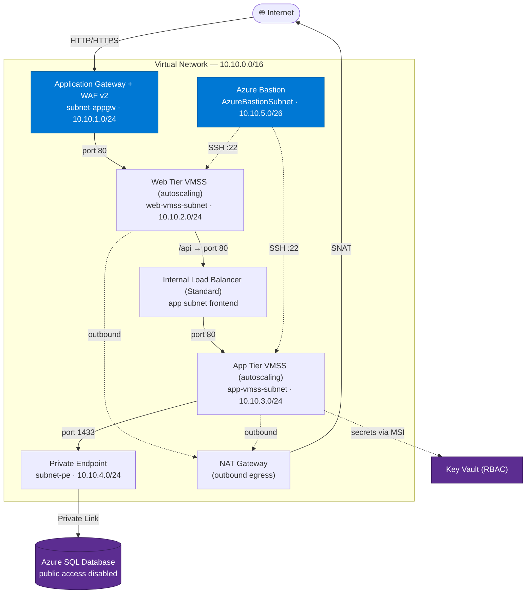

# Azure Multi-Tier VMSS Platform (Terraform)


A production-style, **highly available multi-tier web platform on Microsoft Azure**, fully defined as **Infrastructure as Code (IaC)** with **Terraform**. Internet traffic is terminated at an **Application Gateway with a Web Application Firewall (WAF)**, distributed across an **auto-scaling web tier**, proxied through an **internal load balancer** to a **private app tier**, which reaches an **Azure SQL Database over a Private Endpoint** — with **Azure Bastion** for administrative access and **Key Vault** for secrets.

The design goal: a securely segmented, self-scaling environment where traffic flows cleanly from the public edge all the way to the database, and **no tier is publicly exposed except the front door.**

---

## Table of Contents
- [Architecture](#architecture)
- [How Traffic Flows](#how-traffic-flows)
- [Network Segmentation & NSGs](#network-segmentation--nsgs)
- [Core Components](#core-components)
- [Autoscaling](#autoscaling)
- [Security Model](#security-model)
- [Repository Structure](#repository-structure)
- [Getting Started](#getting-started)
- [CI/CD Pipeline](#cicd-pipeline)
- [Environments](#environments)
- [Design Notes](#design-notes)
- [Roadmap](#roadmap)

---

## Architecture

Everything lives inside a single Virtual Network (`10.10.0.0/16`) carved into purpose-built subnets, each protected by its own Network Security Group.



---

## How Traffic Flows

1. **Internet → Application Gateway (WAF).** All inbound traffic hits the Application Gateway's public IP. The **WAF v2 policy (OWASP 3.2, Prevention mode)** inspects requests before anything reaches compute. Only ports **80/443** are accepted from the internet.
2. **Application Gateway → Web Tier.** The gateway load-balances requests across the **web-tier VMSS**, whose instances are registered in the gateway's backend pool. The web NSG only accepts port 80 **from the Application Gateway subnet** — the internet cannot reach the VMs directly.
3. **Web Tier → Internal Load Balancer → App Tier.** The web tier acts as a reverse proxy (`/api/`) to the **internal Standard Load Balancer**, which distributes to the **private app-tier VMSS**. The app NSG only accepts port 80 **from the web-tier subnet**.
4. **App Tier → Azure SQL (Private Endpoint).** The app tier connects to **Azure SQL Database over a Private Endpoint** on port 1433. A **Private DNS zone** (`privatelink.database.windows.net`) linked to the VNet resolves the SQL FQDN to its private IP. **Public network access to SQL is disabled** — the database is only reachable from inside the VNet.
5. **Outbound egress → NAT Gateway.** The private web/app tiers have **no public IPs**. A **NAT Gateway** provides deterministic outbound connectivity (package installs, updates) — required since Azure retired default outbound access.
6. **Administrative access → Azure Bastion.** Operators reach the VMs over SSH **exclusively through Azure Bastion** — there are no public SSH endpoints and no jump-box to manage.

---

## Network Segmentation & NSGs

Every subnet is isolated by a dedicated NSG enforcing least-privilege ingress:

| Subnet | Purpose | Key Inbound Rules |
|--------|---------|-------------------|
| `subnet-appgw` (10.10.1.0/24) | Application Gateway + WAF | Allow 80/443 from **Internet**; GatewayManager 65200-65535; Azure LB health probes |
| `web-vmss-subnet` (10.10.2.0/24) | Web tier VMSS | Allow 80 from **App Gateway subnet**; SSH 22 from **Bastion**; **deny Internet** |
| `app-vmss-subnet` (10.10.3.0/24) | App tier VMSS | Allow 80 from **Web subnet**; Azure LB probe; SSH 22 from **Bastion**; **deny Internet** |
| `subnet-pe` (10.10.4.0/24) | SQL Private Endpoint | Allow 1433 **only from App subnet**; **deny all other inbound** (NSG enforcement enabled) |
| `AzureBastionSubnet` (10.10.5.0/26) | Azure Bastion | Azure-required Bastion rule set (443 inbound, host comms, SSH/RDP outbound to VNet) |

---

## Core Components

| Component | Azure Resource | Role |
|-----------|----------------|------|
| **Edge / WAF** | Application Gateway v2 + WAF Policy | Public ingress, OWASP protection, L7 routing |
| **Web tier** | Linux VMSS (Ubuntu 22.04) | Stateless front-end, reverse proxy to app tier |
| **Internal LB** | Standard Load Balancer | Distributes web → app traffic privately |
| **App tier** | Linux VMSS (Ubuntu 22.04) | Private application workload |
| **Database** | Azure SQL Database | Managed data tier, private-endpoint only |
| **Secrets** | Azure Key Vault (RBAC) | Generates & stores the SQL admin password; app tier granted `Key Vault Secrets User` via managed identity |
| **Admin access** | Azure Bastion | Browser/SSH access with no public VM IPs |
| **Egress** | NAT Gateway | Outbound internet for private tiers |
| **Observability** | Azure Monitor + Log Analytics (autoscale, diagnostics, action group, metric & health alerts) | Scaling, metric retention, CPU/availability/health alerting |
| **State** | Azure Storage (remote backend) | Terraform state, per environment |

---

## Autoscaling

Both the web and app tiers scale automatically on CPU via `azurerm_monitor_autoscale_setting`:

- **Scale out:** average CPU **> 70%** sustained over **5 minutes** → **+1 instance** (5-minute cooldown)
- **Scale in:** average CPU **< 40%** over **10 minutes** → **−1 instance** (10-minute cooldown)
- **Floor:** always at least **1 instance**, regardless of environment
- **Ceiling:** per-environment via tfvars (dev/prod/dr tuned independently)

This keeps the platform responsive under load while reducing spend during quiet periods.

---

## Monitoring & Alerting

- **Log Analytics workspace** — a per-environment workspace (`log-<prefix>`) collects diagnostics; retention is tunable via `log_retention_in_days` (default 30).
- **Diagnostic settings** — both VMSS tiers ship their platform metrics (`AllMetrics`) to the workspace for querying and retention. *(Scale-set resources expose metrics only; guest OS logs would require the Azure Monitor Agent + a data collection rule.)*
- **Alerts** route to a single action group (`ag-alerts-<prefix>`) that emails `alert_email`:
  - **High CPU** (web & app) — average CPU **> 70%** over 5 min (severity 2).
  - **VM availability** (web & app) — availability **< 100%** over 5 min, i.e. an instance became unavailable (severity 1).
  - **Resource health** (web & app) — Azure reports the scale set as **Degraded** or **Unavailable** (activity-log alert).

---

## Security Model

- **No public compute** — only the Application Gateway has a public IP; every VM sits in a private subnet.
- **Defense in depth** — WAF at the edge + per-subnet NSGs enforcing least privilege between tiers.
- **Private data tier** — SQL public access disabled; reachable only via Private Endpoint + Private DNS.
- **No standing SSH exposure** — administrative access is brokered through Azure Bastion.
- **Secretless code** — the SQL admin password is generated by Terraform and stored in Key Vault; the app tier reads it via a **system-assigned managed identity** (RBAC), so no credentials live in source or state variables.
- **Keyless CI/CD** — GitHub Actions authenticates to Azure with **OIDC federation** (no stored service-principal secrets).

---

## Repository Structure

```
.
├── environments/            # One deployable root per environment
│   ├── dev/                 # main.tf, variables.tf, locals.tf, outputs.tf,
│   ├── prod/                # backend.tf, providers.tf, *.tfvars.examples
│   └── dr/
├── modules/                 # Reusable building blocks
│   ├── network/             # VNet, subnets, NSGs, NAT Gateway
│   ├── app_gateway/         # Application Gateway + WAF policy
│   ├── internal_lb/         # Internal Standard Load Balancer
│   ├── web_vmss/            # Web tier scale set + cloud-init
│   ├── app_vmss/            # App tier scale set + cloud-init
│   ├── database/            # Azure SQL, Private Endpoint, Private DNS
│   ├── keyvault/            # Key Vault + RBAC + generated secrets
│   ├── bastion/             # Azure Bastion host
│   ├── monitoring/          # Log Analytics, diagnostics, autoscale, action group, metric & health alerts
│   └── storage_account/     # Remote-state backend bootstrap script
└── .github/workflows/       # terraform-pr.yml (plan) + terraform-apply.yml (apply)
```

---

## Getting Started

### Prerequisites
- [Terraform](https://developer.hashicorp.com/terraform/downloads) >= 1.6
- [Azure CLI](https://learn.microsoft.com/cli/azure/install-azure-cli) (authenticated via `az login`)
- An Azure subscription with permissions to create the resources above
- An SSH public key for VMSS admin access

### 1. Bootstrap the remote state backend (once)
Terraform state is stored in an Azure Storage account. Create it first:
```bash
cd modules/storage_account
./backend.sh          # creates the resource group, storage account, and blob container
```

### 2. Provide variables
Copy the example tfvars for your environment and fill in the required values (SSH key, alert email, etc.):
```bash
cd environments/dev
cp dev.tfvars.examples dev.tfvars
# edit dev.tfvars
```

### 3. Initialize, plan, apply
```bash
terraform init
terraform plan  -var-file="dev.tfvars" -out=tfplan
terraform apply tfplan
```

### 4. Access the site
Terraform outputs the public URL and key resource names:
```bash
terraform output website_url
terraform output bastion_name
```

---

## CI/CD Pipeline

Two GitHub Actions workflows, both authenticating to Azure via **OIDC** (no long-lived secrets):

- **`terraform-pr.yml`** — on pull requests to `main`: runs `terraform fmt -check`, `init`, `validate`, and `plan`. Gates every change with a preview.
- **`terraform-apply.yml`** — on merge to `main`: runs `init`, `validate`, `plan`, and `apply` for the `dev` environment.

Both are scoped to changes under `environments/**` and `modules/**`.

---

## Environments

The project is structured for **dev**, **prod**, and **dr**, each with its own state key, tfvars, and provider config, all consuming the same shared modules. This keeps environments consistent while allowing per-environment tuning (instance ceilings, SKUs, zone redundancy) without code duplication.

---

## Design Notes

- The web and app tiers run a lightweight demonstration workload (nginx serving a landing page / JSON health response) provisioned via cloud-init. The **Azure SQL Database and Key Vault are fully wired into the network and identity model** — private connectivity, DNS resolution, enforced NSGs, and managed-identity RBAC — ready to back a real application. They model the data and secrets tiers of a production system rather than a specific app's logic.
- Compute is intentionally **stateless** ("cattle, not pets"): recovery is a redeploy from this codebase, not a VM restore. This shapes the backup/DR approach in the roadmap below.

---

## Roadmap

Planned extensions that build on the current foundation:

- **Observability** — a central **Log Analytics Workspace** with VMSS diagnostics and availability/health alerting is now in place (see [Monitoring & Alerting](#monitoring--alerting)). Remaining: extend diagnostic settings to the Application Gateway (incl. **WAF logs**), SQL, Key Vault, and NSG flow logs; add guest-level metrics via the Azure Monitor Agent; add availability tests.
- **Data protection / backup** — Azure SQL **short-term (PITR) and long-term retention (LTR)** policies; Key Vault soft-delete + purge protection; state storage versioning.
- **Disaster recovery** — cross-region **SQL failover groups** plus a warm redeploy into the `dr` environment, fronted by **Traffic Manager / Azure Front Door** for regional failover.
- **TLS** — HTTPS listener on the Application Gateway with a managed certificate.

---

## License
See [LICENSE](./LICENSE).
